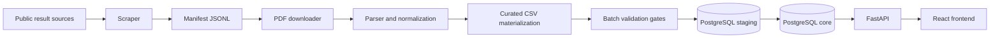

# SwimStats Chile

**SwimStats Chile** is a data platform for Chilean competitive swimming results, athletes and clubs.

The project transforms fragmented competition results, mostly published as PDFs or event-specific files, into structured, auditable and queryable data. It combines a backend ingestion pipeline, a PostgreSQL core model, a FastAPI layer and a React frontend.

## Why this project exists

Swimming results are often published in semi-structured formats that are hard to search, compare or analyze over time. SwimStats Chile turns those sources into normalized data so athletes, clubs and competitions can be explored with better traceability.

The current dataset focuses on Chilean master swimming results, especially public FCHMN result documents, but the product identity intentionally avoids depending on a single federation as its brand.

## Architecture overview



## Monorepo structure

```text
backend/     Data ingestion pipeline, PostgreSQL schema, FastAPI endpoints and backend tests.
frontend/    React + TypeScript UI consuming API contracts and mock fixtures during integration.
docs/        Cross-project roadmap, plans and portfolio-level documentation.
conventions/ English agent conventions (mirrors AGENTS.md).
ci/          CI scripts; GitHub Actions workflows in .github/workflows/.
.cursor/     Cursor rules and project agent skills.
```

Operational agent rules and tool-specific metadata may also live at the repository root when required by the development workflow.

- [Cursor rules and agents](.cursor/README.md)
- [Agent conventions (English)](conventions/AGENTS.en.md)
- [CI scripts and workflows](ci/README.md)
- [Project audit (2026-07-11)](docs/audit/2026-07-11-project-audit.md)

## Reproducibility

**Requirements:** Python 3.12+, Node.js 20+, Docker optional.

### Backend (local)

```bash
python -m venv backend/.venv
source backend/.venv/bin/activate          # Windows: backend\.venv\Scripts\activate
pip install -r backend/requirements.txt
cp backend/.env.example backend/.env       # set DATABASE_URL or DB_* vars
python -m pytest backend/tests -q
```

### Backend + PostgreSQL (Docker)

```bash
docker compose up --build
```

- API: http://localhost:8000
- Postgres: `localhost:5432` — db `natacion_chile`, user/password `postgres`

### Frontend

```bash
cd frontend
cp .env.example .env                       # VITE_API_URL=http://localhost:8000
npm ci
npm run dev                                # http://localhost:5173
```

### CI parity (from repo root)

```bash
./ci/scripts/backend-test.sh
./ci/scripts/frontend-check.sh
```

See also `backend/pyproject.toml`, `backend/Dockerfile`, `.python-version`, and [backend README](backend/README.md).

## Tech stack

- **Backend:** Python, FastAPI, PostgreSQL, CLI pipelines.
- **Data processing:** PDF parsing, CSV materialization, staging/core loading, validation gates.
- **Frontend:** React, TypeScript, Vite, Tailwind CSS, TanStack Query, Zod.
- **Documentation:** Markdown and Mermaid diagrams.

## Current status

This project is under active development.

Current focus:

- Auditable backend pipeline for historical result ingestion.
- Curated athlete and club identity handling before loading data into core tables.
- FastAPI endpoints for athletes, clubs and competition data.
- Frontend foundation with contract-first integration.

Planned:

- OpenAPI-based TypeScript generation from FastAPI contracts.
- Athlete and club profile pages.
- Competition result dashboards.
- Historical performance analysis and rankings.

## Subprojects

- [Backend documentation](backend/README.md)
- [Frontend documentation](frontend/README.md)
- [Implementation roadmap](docs/plans/implementation_plan.md)

## Data disclaimer

This project is intended for educational and portfolio purposes. Data sources may include publicly available swimming competition results. The repository does not represent an official federation platform, and raw/private data should not be committed to version control.
