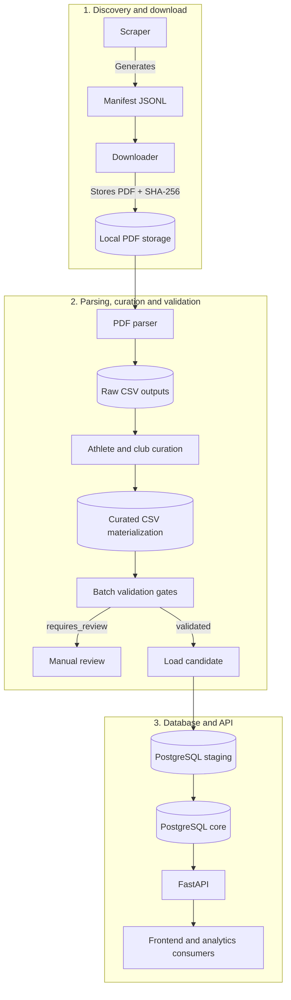

# SwimStats Chile - Backend

Backend data platform for **SwimStats Chile**, focused on ingesting, normalizing, validating and exposing Chilean competitive swimming results.

The current dataset focuses on master swimming results published in public documents, including FCHMN sources, but the backend is designed as a reusable data pipeline rather than a federation-specific script collection.

## Business value

Swimming competition results are often distributed as PDFs or event-specific files. That makes it difficult to search athlete histories, compare performances, audit records or build public-facing analytics.

This backend creates a traceable source of truth by extracting structured data from semi-structured result files, applying validation gates, curating identity conflicts and exposing normalized data through PostgreSQL and FastAPI.

## Data architecture

## Backend responsibilities

- Discover and download public result documents through auditable manifests.
- Parse semi-structured competition result files.
- Normalize athletes, clubs, events, individual results and relays.
- Materialize reviewed identity decisions before loading data.
- Load data through staging tables into the core relational model.
- Preserve traceability with source documents, load runs and validation issues.
- Expose validated data through FastAPI endpoints.
- Expose analytics endpoints for swimmer rankings, club participation and competition statistics.

## Design decisions

1. **Staging before core:** Data enters `stg_*` tables before being inserted into the core schema.
2. **Traceability first:** Each load records parser version, source URL, PDF checksum, load run and validation state.
3. **Controlled identity curation:** Athlete identity is curated before load; club history is contextual and must not define long-term athlete identity by itself.
4. **Quality gates:** Documents with blocking issues stay in `requires_review` and must not be loaded into core.
5. **API as product boundary:** The frontend consumes FastAPI endpoints, not direct database access.
6. **Analytics from core facts:** Rankings and participation statistics are derived from `core.result`, `core.event`, `core.competition`, `core.athlete` and `core.club`; historical club representation uses `result.club_id`.

## Technologies

- Python 3
- FastAPI
- PostgreSQL
- PDF parsing with layout-aware heuristics
- CLI-based batch orchestration
- Pytest for backend contracts and regression tests

## Key files

- `scripts/scrape_fchmn.py`: Discovers result PDF URLs and writes manifests.
- `scripts/download_manifest_pdfs.py`: Downloads manifest PDFs and records checksums.
- `scripts/parse_results_pdf.py`: Converts PDFs into operational CSVs.
- `scripts/curate_athlete_names.py`: Applies reviewed athlete identity curation before load.
- `scripts/run_results_batch.py`: Runs parse/validation/load orchestration.
- `scripts/run_pipeline_results.py`: Loads CSVs into staging and core tables.
- `sql/schema.sql`: Core and staging schema.
- `sql/migrations/`: Incremental database migrations.
- `api/routers/rankings.py`: Swimmer ranking endpoints and ranking filter catalog.
- `api/routers/stats.py`: Participation statistics endpoints.

## Safe ingestion flow

1. Discover URLs and write a manifest.
2. Download PDFs and record checksums.
3. Parse and validate without `--load`.
4. Freeze or curate a validated manifest.
5. Follow `docs/pre_load_checklist.md` before any explicit load.
6. Load only reviewed, scoped and validated documents.
7. Run post-load audits against the database.

## Additional documentation

- [AI workflow](docs/ai_workflow.md)
- [Pre-load checklist](docs/pre_load_checklist.md)
- [Validation runbook](docs/fchmn_results_validation.md)
- [Schema documentation](docs/schema.md)
- [Batch runner contract](docs/batch_runner_contract.md)
- [Parser contracts](docs/parser_contracts.md)
- [Changelog](docs/CHANGELOG.md)
