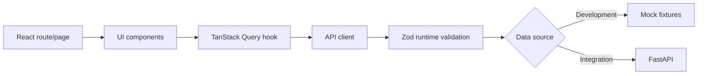

# SwimStats Chile - Frontend

Frontend application for **SwimStats Chile**, a data platform for Chilean competitive swimming results, athletes and clubs.

The frontend is a React single-page application focused on presenting validated backend data through athlete, club and competition views.

## Architecture and methodology

The frontend is developed with a contract-first approach. During the initial integration phase, API contracts are documented manually and validated at runtime with Zod schemas. The target architecture is to use the OpenAPI/Swagger specification generated by FastAPI as the source for TypeScript type generation.



## Frontend responsibilities

- Render athlete, club and competition data in a user-friendly interface.
- Consume backend data through API contracts, never direct database access.
- Keep business rules and identity curation in the backend.
- Use mocks and fixtures while backend contracts are stabilized.
- Validate API responses at the frontend boundary.

## Tech stack

- React + TypeScript + Vite
- Tailwind CSS v4
- React Router
- TanStack Query
- Zod
- ESLint

## Development

```bash
npm install
npm run dev
```

Use `npm run lint` when changing frontend code. Documentation-only changes do not require a frontend build.

## Internal documentation

- [UI workflow](docs/ui_workflow.md)
- [API contracts](docs/api_contracts.md)
